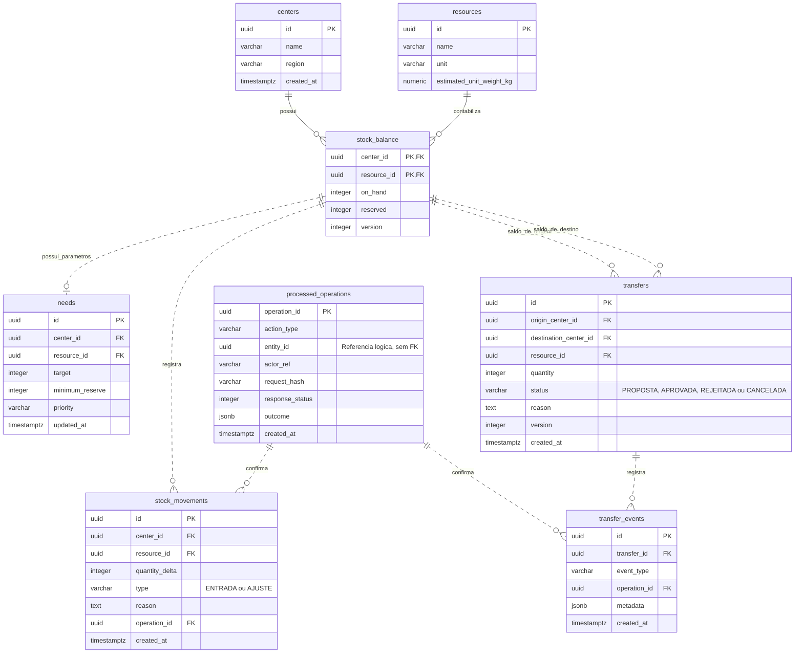

# Rota Viva — Modelagem de dados — Etapas 1 e 2

```mermaid
erDiagram
    centers ||--o{ stockBalance : possui
    resources ||--o{ stockBalance : contabiliza
    stockBalance ||..o| needs : possui_parametros
    stockBalance ||..o{ stockMovements : registra
    stockBalance ||..o{ transfers : saldo_de_origem
    stockBalance ||..o{ transfers : saldo_de_destino
    transfers ||..o{ transferEvents : registra
    processedOperations ||..o{ stockMovements : confirma
    processedOperations ||..o{ transferEvents : confirma

    centers["centers"] {
        uuid id PK
        varchar name
        varchar region
        timestamptz created_at
    }

    resources["resources"] {
        uuid id PK
        varchar name
        varchar unit
        numeric estimated_unit_weight_kg
    }

    stockBalance["stock_balance"] {
        uuid center_id PK, FK
        uuid resource_id PK, FK
        integer on_hand
        integer reserved
        integer version
    }

    needs["needs"] {
        uuid id PK
        uuid center_id FK
        uuid resource_id FK
        integer target
        integer minimum_reserve
        varchar priority
        timestamptz updated_at
    }

    transfers["transfers"] {
        uuid id PK
        uuid origin_center_id FK
        uuid destination_center_id FK
        uuid resource_id FK
        integer quantity
        varchar status "PROPOSTA, APROVADA, REJEITADA ou CANCELADA"
        text reason
        integer version
        timestamptz created_at
    }

    stockMovements["stock_movements"] {
        uuid id PK
        uuid center_id FK
        uuid resource_id FK
        integer quantity_delta
        varchar type "ENTRADA ou AJUSTE"
        text reason
        uuid operation_id FK
        timestamptz created_at
    }

    transferEvents["transfer_events"] {
        uuid id PK
        uuid transfer_id FK
        varchar event_type
        uuid operation_id FK
        jsonb metadata
        timestamptz created_at
    }

    processedOperations["processed_operations"] {
        uuid operation_id PK
        varchar action_type
        uuid entity_id "Referencia logica, sem FK"
        varchar actor_ref
        varchar request_hash
        integer response_status
        jsonb outcome
        timestamptz created_at
    }
```
